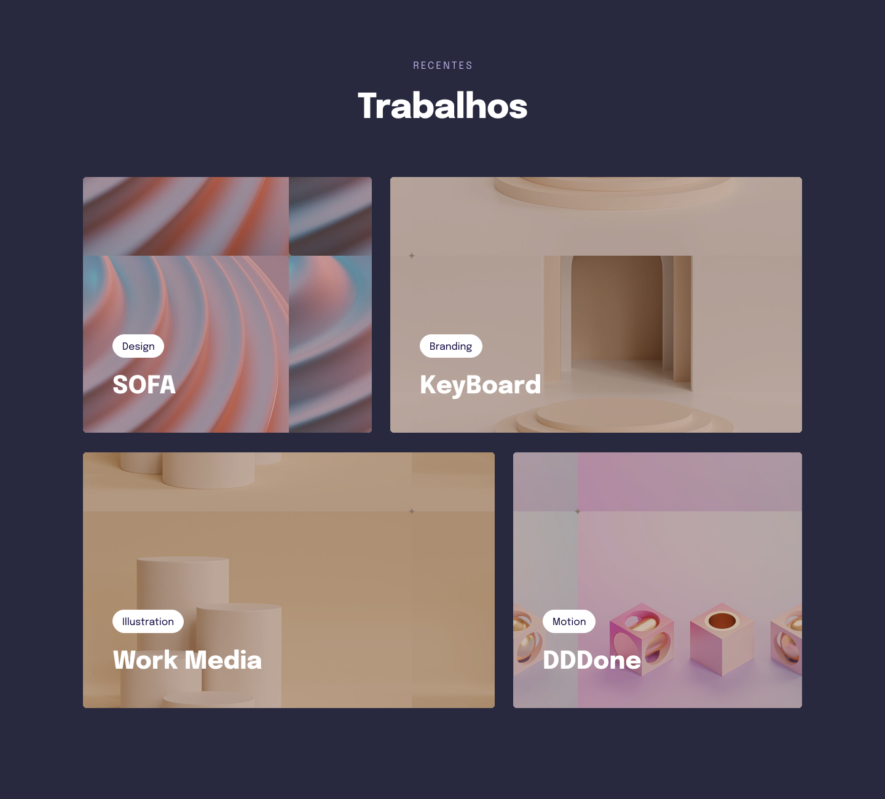

<h1 align="center">Responsividade</h1>

 Projeto desenvolvido através do curso Explorer da Rocketseat, plataforma de ensino de tecnologia Web .    

  <a href="#-tecnologias">Tecnologias</a>&nbsp;&nbsp;&nbsp;|&nbsp;&nbsp;&nbsp;
  <a href="#-projeto">Projeto</a>&nbsp;&nbsp;&nbsp;|&nbsp;&nbsp;&nbsp;
  <a href="#-layout">Layout</a>&nbsp;&nbsp;&nbsp;|&nbsp;&nbsp;&nbsp;
  <a href="#memo-licença">Licença</a>

  

 

  

## 🚀 Tecnologias

Esse projeto foi desenvolvido com as seguintes tecnologias:

- HTML
- CSS
- Figma

## 💻 Projeto

Aplicando os conceitos iniciais de responsividade . -[Visite o projeto online](#)

## 🔖 Layout

Você pode visualizar o layout do projeto através [DESSE LINK]https://www.figma.com/file/wmd8LsB1W8w6Twej5ANY74/Explorer-Stage-03-Projeto-03-(Copy)?node-id=203%3A1925&t=xGBhI49oGazH5t9U-0.
